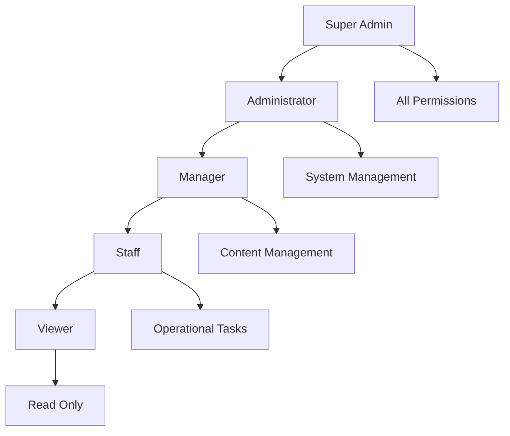
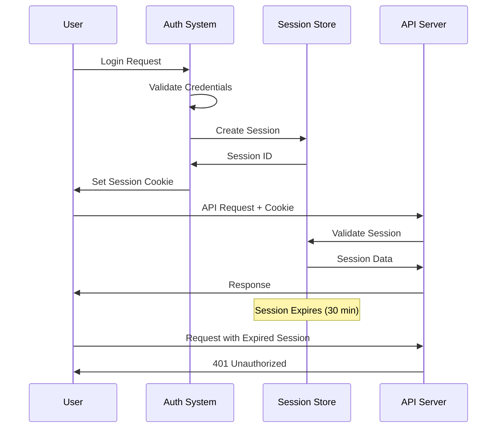
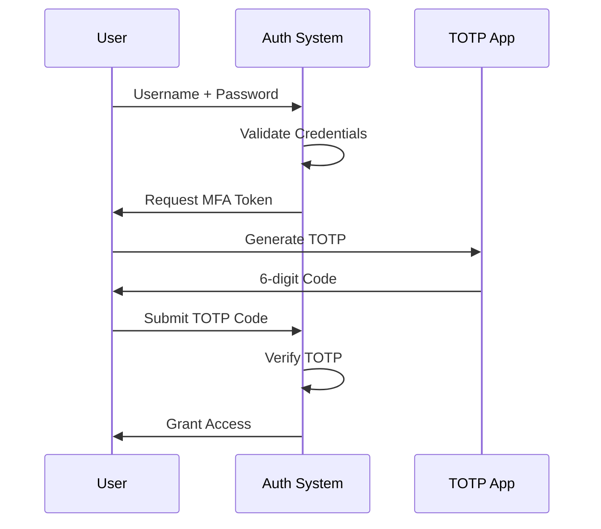

# Authentication

CitizenAI provides flexible authentication mechanisms to secure access to the platform and its APIs. This guide covers authentication methods, security best practices, and implementation details.

## Authentication Methods

### Session-Based Authentication

The primary authentication method for web users:

```python
# Login endpoint
POST /api/v1/auth/login
Content-Type: application/json

{
    "username": "admin",
    "password": "password",
    "remember_me": false
}
```

**Successful Response:**
```json
{
    "success": true,
    "data": {
        "user": {
            "id": "admin",
            "username": "admin", 
            "role": "administrator",
            "permissions": ["read", "write", "admin"],
            "last_login": "2025-01-01T10:00:00Z"
        },
        "session": {
            "id": "sess_abc123xyz",
            "expires_at": "2025-01-01T18:00:00Z",
            "csrf_token": "csrf_token_here"
        }
    },
    "metadata": {
        "timestamp": "2025-01-01T10:00:00Z",
        "version": "v1"
    }
}
```

### API Key Authentication

For programmatic access and integrations:

```http
Authorization: Bearer your-api-key-here
Content-Type: application/json
```

**API Key Format:**
```
ca_live_1234567890abcdef1234567890abcdef
├─┬─ ├──────────────┬──────────────────┘
│ │  │              └─ Key data (32 chars)
│ │  └─ Environment prefix  
│ └─ Key type
└─ Product prefix (CitizenAI)
```

## User Roles and Permissions

### Role Hierarchy



### Permission Matrix

| Permission | Viewer | Staff | Manager | Admin | Super Admin |
|------------|--------|-------|---------|-------|-------------|
| **View Dashboard** | ✅ | ✅ | ✅ | ✅ | ✅ |
| **View Analytics** | ✅ | ✅ | ✅ | ✅ | ✅ |
| **Chat Management** | ❌ | ✅ | ✅ | ✅ | ✅ |
| **Concern Management** | ❌ | ✅ | ✅ | ✅ | ✅ |
| **User Management** | ❌ | ❌ | ✅ | ✅ | ✅ |
| **System Configuration** | ❌ | ❌ | ❌ | ✅ | ✅ |
| **API Key Management** | ❌ | ❌ | ❌ | ✅ | ✅ |
| **Audit Logs** | ❌ | ❌ | ❌ | ✅ | ✅ |

## Session Management

### Session Configuration

```python
# Flask session configuration
SESSION_CONFIG = {
    "SESSION_TYPE": "filesystem",
    "SESSION_PERMANENT": False,
    "SESSION_USE_SIGNER": True,
    "SESSION_KEY_PREFIX": "citizenai:",
    "SESSION_FILE_THRESHOLD": 500,
    "PERMANENT_SESSION_LIFETIME": 1800,  # 30 minutes
    "SESSION_COOKIE_SECURE": True,       # HTTPS only
    "SESSION_COOKIE_HTTPONLY": True,     # No JavaScript access
    "SESSION_COOKIE_SAMESITE": "Lax"     # CSRF protection
}
```

### Session Lifecycle



## API Authentication

### Request Headers

All authenticated API requests must include:

```http
Authorization: Bearer your-api-key
Content-Type: application/json
X-API-Version: v1
User-Agent: YourApp/1.0
```

### API Key Management

#### Creating API Keys

```python
# Generate new API key
POST /api/v1/auth/api-keys
Authorization: Bearer admin-session-token

{
    "name": "Integration API Key",
    "permissions": ["chat:read", "analytics:read", "concerns:write"],
    "expires_at": "2025-12-31T23:59:59Z",
    "description": "Key for external system integration"
}
```

**Response:**
```json
{
    "success": true,
    "data": {
        "key_id": "key_12345",
        "api_key": "ca_live_1234567890abcdef1234567890abcdef",
        "name": "Integration API Key",
        "permissions": ["chat:read", "analytics:read", "concerns:write"],
        "created_at": "2025-01-01T10:00:00Z",
        "expires_at": "2025-12-31T23:59:59Z"
    }
}
```

#### Listing API Keys

```python
# List all API keys for current user
GET /api/v1/auth/api-keys
Authorization: Bearer admin-session-token
```

#### Revoking API Keys

```python
# Revoke specific API key
DELETE /api/v1/auth/api-keys/{key_id}
Authorization: Bearer admin-session-token
```

### Rate Limiting

API requests are rate-limited based on authentication method:

| Auth Method | Rate Limit | Burst Limit | Window |
|-------------|------------|-------------|--------|
| **Session** | 1000/hour | 50/minute | Rolling |
| **API Key** | 5000/hour | 100/minute | Rolling |
| **Anonymous** | 100/hour | 10/minute | Rolling |

**Rate Limit Headers:**
```http
X-RateLimit-Limit: 1000
X-RateLimit-Remaining: 999
X-RateLimit-Reset: 1609459200
X-RateLimit-Window: 3600
```

## Security Features

### CSRF Protection

Cross-Site Request Forgery protection for web forms:

```html
<!-- CSRF token in forms -->
<form method="POST" action="/api/v1/concerns">
    <input type="hidden" name="csrf_token" value="{{ csrf_token() }}">
    <!-- form fields -->
</form>
```

```javascript
// CSRF token in AJAX requests
fetch('/api/v1/chat/message', {
    method: 'POST',
    headers: {
        'Content-Type': 'application/json',
        'X-CSRFToken': getCsrfToken()
    },
    body: JSON.stringify({message: 'Hello'})
});
```

### Password Security

#### Password Requirements

```python
PASSWORD_POLICY = {
    "min_length": 8,
    "max_length": 128,
    "require_uppercase": True,
    "require_lowercase": True,
    "require_numbers": True,
    "require_special_chars": True,
    "forbidden_patterns": [
        "password", "123456", "qwerty",
        "admin", "user", "guest"
    ],
    "max_age_days": 90,
    "history_check": 5  # Cannot reuse last 5 passwords
}
```

#### Password Hashing

```python
# Using Argon2 for password hashing
from argon2 import PasswordHasher
from argon2.exceptions import VerifyMismatchError

ph = PasswordHasher()

# Hash password
def hash_password(password: str) -> str:
    return ph.hash(password)

# Verify password
def verify_password(hashed: str, password: str) -> bool:
    try:
        ph.verify(hashed, password)
        return True
    except VerifyMismatchError:
        return False
```

### Multi-Factor Authentication (MFA)

#### TOTP (Time-based One-Time Password)

```python
# Enable MFA for user
POST /api/v1/auth/mfa/enable
Authorization: Bearer session-token

{
    "method": "totp",
    "backup_codes": true
}
```

**Response:**
```json
{
    "success": true,
    "data": {
        "secret": "JBSWY3DPEHPK3PXP",
        "qr_code": "data:image/png;base64,iVBORw0KGgoAAAANSUhEUgAA...",
        "backup_codes": [
            "12345678", "87654321", "11223344",
            "55667788", "99887766", "44332211"
        ]
    }
}
```

#### MFA Login Flow



## Single Sign-On (SSO)

### SAML Integration

```python
# SAML configuration
SAML_CONFIG = {
    "sp": {
        "entityId": "https://your-domain.com/saml/metadata",
        "assertionConsumerService": {
            "url": "https://your-domain.com/saml/acs",
            "binding": "urn:oasis:names:tc:SAML:2.0:bindings:HTTP-POST"
        }
    },
    "idp": {
        "entityId": "https://idp.example.com/metadata",
        "singleSignOnService": {
            "url": "https://idp.example.com/sso",
            "binding": "urn:oasis:names:tc:SAML:2.0:bindings:HTTP-Redirect"
        }
    }
}
```

### OAuth 2.0 / OpenID Connect

```python
# OAuth configuration
OAUTH_CONFIG = {
    "google": {
        "client_id": "your-google-client-id",
        "client_secret": "your-google-client-secret",
        "server_metadata_url": "https://accounts.google.com/.well-known/openid_configuration",
        "client_kwargs": {
            "scope": "openid email profile"
        }
    },
    "microsoft": {
        "client_id": "your-azure-client-id",
        "client_secret": "your-azure-client-secret",
        "server_metadata_url": "https://login.microsoftonline.com/common/v2.0/.well-known/openid_configuration"
    }
}
```

## Token Management

### JWT Tokens

For stateless authentication in distributed systems:

```python
# JWT token structure
{
    "header": {
        "alg": "HS256",
        "typ": "JWT"
    },
    "payload": {
        "sub": "user_12345",
        "username": "admin",
        "role": "administrator",
        "permissions": ["read", "write", "admin"],
        "iat": 1609459200,
        "exp": 1609462800,
        "iss": "citizenai-auth",
        "aud": "citizenai-api"
    }
}
```

### Refresh Tokens

```python
# Token refresh endpoint
POST /api/v1/auth/refresh
Content-Type: application/json

{
    "refresh_token": "rt_1234567890abcdef"
}
```

**Response:**
```json
{
    "success": true,
    "data": {
        "access_token": "jwt_access_token_here",
        "refresh_token": "rt_new_refresh_token_here",
        "token_type": "Bearer",
        "expires_in": 3600
    }
}
```

## Audit Logging

### Authentication Events

All authentication events are logged:

```python
# Audit log entry
{
    "timestamp": "2025-01-01T10:00:00Z",
    "event_type": "auth.login.success",
    "user_id": "admin",
    "username": "admin",
    "ip_address": "192.168.1.100",
    "user_agent": "Mozilla/5.0 (Windows NT 10.0; Win64; x64)",
    "session_id": "sess_abc123xyz",
    "details": {
        "login_method": "password",
        "mfa_used": true,
        "remember_me": false
    }
}
```

### Tracked Events

- `auth.login.attempt`
- `auth.login.success`
- `auth.login.failure`
- `auth.logout`
- `auth.session.expired`
- `auth.password.changed`
- `auth.mfa.enabled`
- `auth.mfa.disabled`
- `auth.api_key.created`
- `auth.api_key.revoked`

## Error Handling

### Authentication Errors

```json
{
    "success": false,
    "error": {
        "code": "AUTHENTICATION_FAILED",
        "message": "Invalid username or password",
        "details": {
            "attempts_remaining": 2,
            "lockout_duration": 900
        }
    },
    "metadata": {
        "timestamp": "2025-01-01T10:00:00Z",
        "request_id": "req_12345"
    }
}
```

### Common Error Codes

| Code | Description | HTTP Status |
|------|-------------|-------------|
| `AUTHENTICATION_REQUIRED` | No authentication provided | 401 |
| `AUTHENTICATION_FAILED` | Invalid credentials | 401 |
| `ACCOUNT_LOCKED` | Too many failed attempts | 423 |
| `SESSION_EXPIRED` | Session has expired | 401 |
| `INSUFFICIENT_PERMISSIONS` | User lacks required permissions | 403 |
| `INVALID_API_KEY` | API key is invalid or expired | 401 |
| `RATE_LIMIT_EXCEEDED` | Too many requests | 429 |
| `MFA_REQUIRED` | Multi-factor authentication needed | 401 |

## Best Practices

### For Developers

!!! tip "Security Best Practices"
    - **Use HTTPS only** in production
    - **Store API keys securely** (environment variables, key vaults)
    - **Implement proper session management**
    - **Validate all inputs** before authentication
    - **Use strong password policies**
    - **Implement rate limiting**
    - **Log authentication events**
    - **Regular security audits**

### For Users

!!! info "User Security Guidelines"
    - **Use strong, unique passwords**
    - **Enable multi-factor authentication**
    - **Log out when finished**
    - **Don't share credentials**
    - **Report suspicious activity**
    - **Keep contact information updated**

## Troubleshooting

### Common Issues

#### Session Not Persisting

```python
# Check session configuration
app.config['SESSION_COOKIE_SECURE'] = False  # For development only
app.config['SESSION_COOKIE_SAMESITE'] = 'Lax'
```

#### API Key Not Working

```bash
# Test API key
curl -H "Authorization: Bearer your-api-key" \
     https://your-domain.com/api/v1/auth/validate
```

#### CSRF Token Errors

```javascript
// Get CSRF token from meta tag
function getCsrfToken() {
    return document.querySelector('meta[name=csrf-token]').getAttribute('content');
}
```

## Next Steps

- **[API Endpoints](endpoints.md)** - Complete API endpoint documentation
- **[User Guide](../user-guide/features.md)** - Learn about platform features
- **[Development Guide](../development/contributing.md)** - Development and integration guidelines
