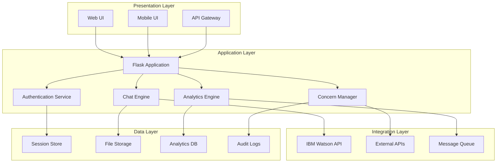
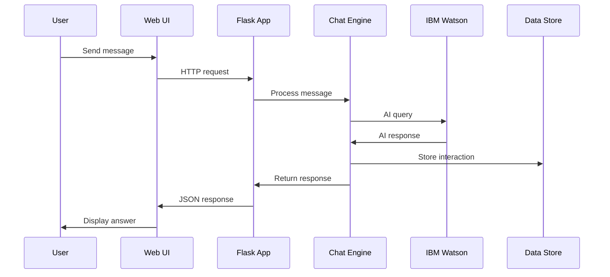
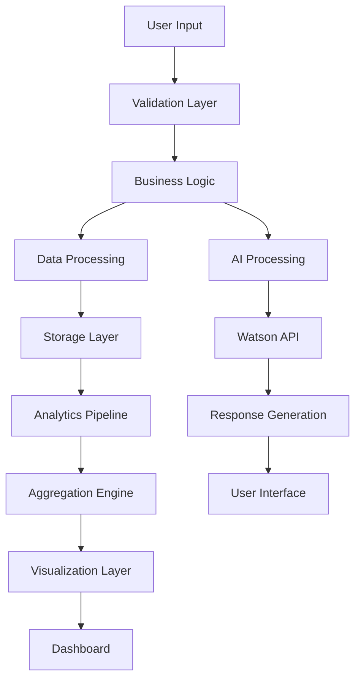
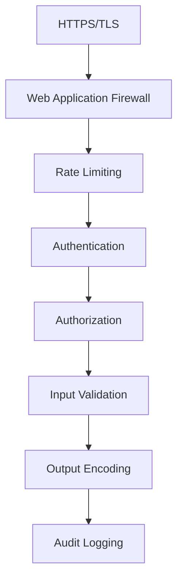
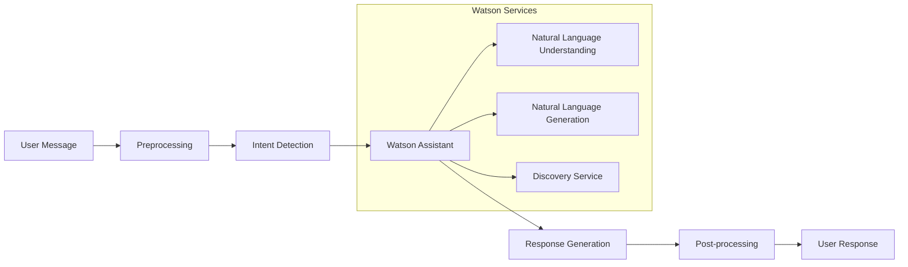
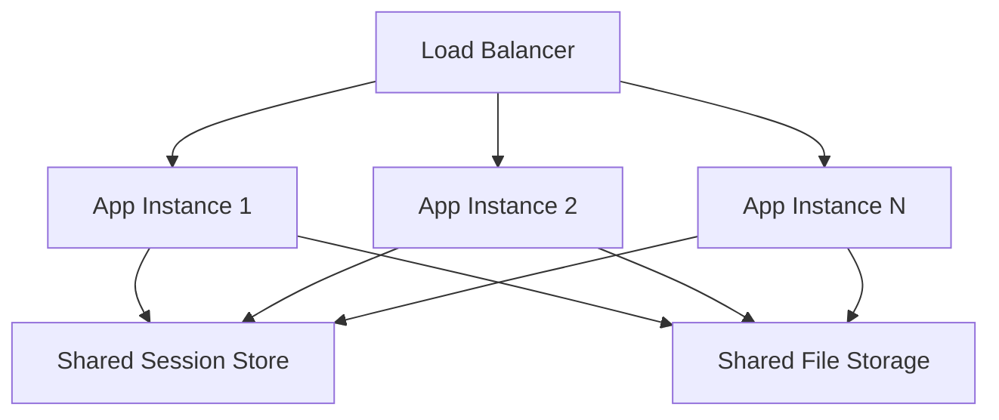
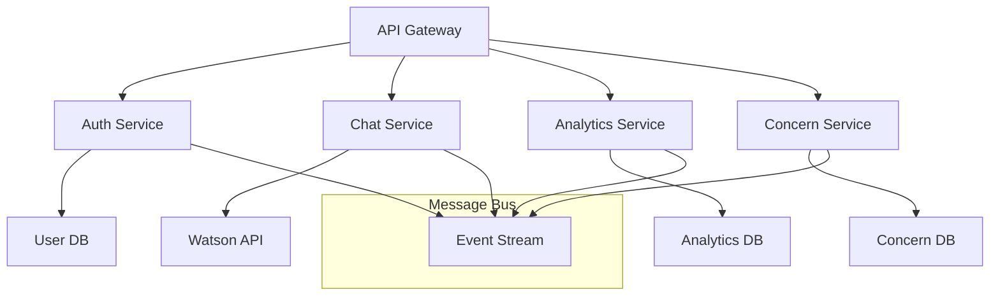

# Architecture

CitizenAI is built with a modern, scalable architecture designed for government-scale citizen engagement. This document outlines the system design, components, and architectural decisions.

## System Overview

CitizenAI follows a layered architecture pattern with clear separation of concerns:



## Technology Stack

### Core Technologies

| Component | Technology | Purpose |
|-----------|------------|---------|
| **Web Framework** | Flask 2.3+ | HTTP server and routing |
| **AI Engine** | IBM Watson, IBM Granite | Natural language processing |
| **Frontend** | HTML5, CSS3, JavaScript | User interface |
| **Visualization** | Plotly.js | Interactive charts and graphs |
| **Session Management** | Flask-Session | User session handling |
| **Authentication** | Custom + OAuth | User authentication |

### Development Stack

```python
# Core dependencies
CORE_STACK = {
    "runtime": "Python 3.11+",
    "web_framework": "Flask 2.3+",
    "ai_platform": "IBM Watson",
    "data_processing": "Pandas, NumPy",
    "visualization": "Plotly",
    "http_client": "Requests",
    "configuration": "python-dotenv"
}

# Development dependencies
DEV_STACK = {
    "testing": "pytest",
    "linting": "flake8, black",
    "documentation": "MkDocs Material",
    "type_checking": "mypy",
    "pre_commit": "pre-commit hooks"
}
```

## Application Architecture

### Modular Design

CitizenAI uses a modular architecture with clear boundaries:

```
src/
├── core/               # Core application logic
│   ├── __init__.py
│   ├── app.py         # Flask application factory
│   ├── config.py      # Configuration management
│   └── extensions.py  # Extension initialization
├── auth/              # Authentication module
│   ├── __init__.py
│   ├── models.py      # User models
│   ├── views.py       # Auth endpoints
│   └── utils.py       # Auth utilities
├── chat/              # Chat functionality
│   ├── __init__.py
│   ├── engine.py      # AI chat engine
│   ├── watson.py      # IBM Watson integration
│   └── handlers.py    # Message handlers
├── analytics/         # Analytics and reporting
│   ├── __init__.py
│   ├── processor.py   # Data processing
│   ├── visualizer.py  # Chart generation
│   └── exporters.py   # Data export
├── concerns/          # Concern management
│   ├── __init__.py
│   ├── models.py      # Concern models
│   ├── manager.py     # Business logic
│   └── notifications.py # Notification system
└── utils/             # Shared utilities
    ├── __init__.py
    ├── helpers.py     # Helper functions
    ├── validators.py  # Input validation
    └── decorators.py  # Custom decorators
```

### Component Interaction



## Data Architecture

### Data Flow



### Storage Strategy

#### Session Storage
```python
# File-based session storage
SESSION_CONFIG = {
    "type": "filesystem",
    "directory": "./flask_session",
    "threshold": 500,
    "mode": 0o600,  # Read/write for owner only
    "permanent": False,
    "use_signer": True
}
```

#### Analytics Data
```python
# In-memory analytics with persistence
ANALYTICS_CONFIG = {
    "storage": "json_files",
    "directory": "./data/analytics",
    "retention_days": 90,
    "aggregation_levels": ["hourly", "daily", "weekly"],
    "real_time_buffer": 1000  # Keep last 1000 events in memory
}
```

#### File Storage
```python
# Secure file handling
FILE_CONFIG = {
    "upload_folder": "./data/uploads",
    "max_file_size": 10 * 1024 * 1024,  # 10MB
    "allowed_extensions": [".jpg", ".png", ".pdf", ".txt"],
    "virus_scanning": True,
    "encryption": "AES-256"
}
```

## Security Architecture

### Security Layers



### Security Implementation

#### Authentication Flow
```python
class AuthenticationManager:
    """Handles user authentication and session management."""
    
    def authenticate(self, username: str, password: str) -> dict:
        """Authenticate user and create session."""
        # 1. Validate input
        if not self.validate_credentials(username, password):
            raise AuthenticationError("Invalid credentials")
        
        # 2. Check user exists and is active
        user = self.get_user(username)
        if not user or not user.is_active:
            raise AuthenticationError("User not found or inactive")
        
        # 3. Verify password
        if not self.verify_password(password, user.password_hash):
            self.log_failed_attempt(username)
            raise AuthenticationError("Invalid password")
        
        # 4. Create session
        session = self.create_session(user)
        self.log_successful_login(user)
        
        return {
            "user": user.to_dict(),
            "session": session.to_dict()
        }
```

#### Authorization System
```python
class AuthorizationManager:
    """Role-based access control."""
    
    PERMISSIONS = {
        "viewer": ["read"],
        "staff": ["read", "write"],
        "manager": ["read", "write", "manage"],
        "admin": ["read", "write", "manage", "admin"]
    }
    
    def check_permission(self, user: User, resource: str, action: str) -> bool:
        """Check if user has permission for action on resource."""
        required_permission = f"{resource}:{action}"
        user_permissions = self.get_user_permissions(user)
        return required_permission in user_permissions
```

## API Architecture

### RESTful Design

CitizenAI follows REST principles with consistent patterns:

```python
# URL patterns
API_PATTERNS = {
    "collections": "/api/v1/concerns",           # GET, POST
    "resources": "/api/v1/concerns/{id}",        # GET, PUT, DELETE
    "actions": "/api/v1/concerns/{id}/resolve",  # POST
    "filters": "/api/v1/concerns?status=open",   # GET with query params
}

# HTTP methods mapping
HTTP_METHODS = {
    "GET": "retrieve",
    "POST": "create", 
    "PUT": "update",
    "PATCH": "partial_update",
    "DELETE": "destroy"
}
```

### API Versioning Strategy

```python
# Version handling
class APIVersioning:
    """Handle API versioning and backwards compatibility."""
    
    SUPPORTED_VERSIONS = ["v1"]
    DEFAULT_VERSION = "v1"
    
    def get_version(self, request):
        """Extract API version from request."""
        # 1. Check URL path: /api/v1/endpoint
        if "/v" in request.path:
            return request.path.split("/")[2]
        
        # 2. Check header: X-API-Version: v1
        if "X-API-Version" in request.headers:
            return request.headers["X-API-Version"]
        
        # 3. Default version
        return self.DEFAULT_VERSION
```

## AI Integration Architecture

### Watson Integration



### AI Pipeline Implementation

```python
class AIEngine:
    """Core AI processing engine."""
    
    def __init__(self, watson_config: dict):
        self.watson = WatsonAssistant(**watson_config)
        self.preprocessor = MessagePreprocessor()
        self.postprocessor = ResponsePostprocessor()
    
    async def process_message(self, message: str, context: dict) -> dict:
        """Process user message through AI pipeline."""
        
        # 1. Preprocess message
        processed_message = self.preprocessor.clean(message)
        
        # 2. Send to Watson
        watson_response = await self.watson.message(
            message=processed_message,
            context=context
        )
        
        # 3. Post-process response
        final_response = self.postprocessor.format(watson_response)
        
        # 4. Extract metadata
        metadata = {
            "confidence": watson_response.get("confidence", 0),
            "intent": watson_response.get("intent", "unknown"),
            "entities": watson_response.get("entities", []),
            "sentiment": self.analyze_sentiment(message)
        }
        
        return {
            "response": final_response,
            "metadata": metadata
        }
```

## Performance Architecture

### Caching Strategy

```python
# Multi-level caching
CACHE_CONFIG = {
    "levels": {
        "memory": {
            "type": "in_memory",
            "size": "100MB",
            "ttl": 300  # 5 minutes
        },
        "redis": {
            "type": "redis",
            "host": "localhost",
            "ttl": 3600  # 1 hour
        },
        "file": {
            "type": "filesystem",
            "directory": "./cache",
            "ttl": 86400  # 24 hours
        }
    }
}
```

### Asynchronous Processing

```python
import asyncio
from concurrent.futures import ThreadPoolExecutor

class AsyncProcessor:
    """Handle asynchronous operations."""
    
    def __init__(self):
        self.executor = ThreadPoolExecutor(max_workers=10)
    
    async def process_chat_message(self, message: str) -> dict:
        """Process chat message asynchronously."""
        loop = asyncio.get_event_loop()
        
        # Run AI processing in thread pool
        result = await loop.run_in_executor(
            self.executor,
            self.ai_engine.process,
            message
        )
        
        return result
```

## Scalability Considerations

### Horizontal Scaling



### Database Scaling

```python
# Database connection pooling
DATABASE_CONFIG = {
    "pool_size": 20,
    "max_overflow": 50,
    "pool_timeout": 30,
    "pool_recycle": 3600,
    "pool_pre_ping": True
}

# Read/write splitting for large deployments
class DatabaseManager:
    def __init__(self):
        self.write_db = create_engine(WRITE_DB_URL, **DATABASE_CONFIG)
        self.read_db = create_engine(READ_DB_URL, **DATABASE_CONFIG)
    
    def get_engine(self, operation: str):
        """Route database operations to appropriate instance."""
        if operation in ["INSERT", "UPDATE", "DELETE"]:
            return self.write_db
        return self.read_db
```

## Monitoring and Observability

### Health Monitoring

```python
class HealthMonitor:
    """System health monitoring."""
    
    def check_system_health(self) -> dict:
        """Comprehensive system health check."""
        return {
            "status": "healthy",
            "timestamp": datetime.utcnow().isoformat(),
            "components": {
                "database": self.check_database(),
                "watson_api": self.check_watson(),
                "file_storage": self.check_storage(),
                "memory": self.check_memory(),
                "disk": self.check_disk()
            },
            "metrics": self.get_performance_metrics()
        }
```

### Logging Architecture

```python
# Structured logging configuration
LOGGING_CONFIG = {
    "version": 1,
    "disable_existing_loggers": False,
    "formatters": {
        "json": {
            "format": "%(asctime)s %(name)s %(levelname)s %(message)s",
            "class": "pythonjsonlogger.jsonlogger.JsonFormatter"
        }
    },
    "handlers": {
        "console": {
            "class": "logging.StreamHandler",
            "formatter": "json"
        },
        "file": {
            "class": "logging.handlers.RotatingFileHandler",
            "filename": "logs/citizenai.log",
            "maxBytes": 10485760,  # 10MB
            "backupCount": 5,
            "formatter": "json"
        }
    },
    "loggers": {
        "citizenai": {
            "handlers": ["console", "file"],
            "level": "INFO",
            "propagate": False
        }
    }
}
```

## Deployment Architecture

### Container Strategy

```dockerfile
# Multi-stage Docker build
FROM python:3.11-slim as builder
WORKDIR /app
COPY requirements.txt .
RUN pip install --no-cache-dir -r requirements.txt

FROM python:3.11-slim as runtime
WORKDIR /app
COPY --from=builder /usr/local/lib/python3.11/site-packages /usr/local/lib/python3.11/site-packages
COPY . .
EXPOSE 5000
CMD ["gunicorn", "--bind", "0.0.0.0:5000", "app:app"]
```

### Environment Configuration

```yaml
# docker-compose.yml
version: '3.8'
services:
  citizenai:
    build: .
    ports:
      - "5000:5000"
    environment:
      - FLASK_ENV=production
      - WATSON_API_KEY=${WATSON_API_KEY}
    volumes:
      - ./data:/app/data
      - ./logs:/app/logs
    restart: unless-stopped
    
  nginx:
    image: nginx:alpine
    ports:
      - "80:80"
      - "443:443"
    volumes:
      - ./nginx.conf:/etc/nginx/nginx.conf
      - ./ssl:/etc/nginx/ssl
    depends_on:
      - citizenai
```

## Future Architecture Considerations

### Microservices Migration



### Cloud-Native Features

- **Service mesh** for inter-service communication
- **Event-driven architecture** with message queues
- **Auto-scaling** based on demand
- **Circuit breakers** for resilience
- **Distributed tracing** for debugging

## Best Practices

### Code Organization

!!! tip "Architecture Best Practices"
    - **Separation of concerns**: Each module has a single responsibility
    - **Dependency injection**: Use factories and dependency injection
    - **Configuration management**: Centralized configuration
    - **Error handling**: Consistent error handling patterns
    - **Testing**: Unit tests for each component
    - **Documentation**: Clear API documentation

### Performance Optimization

- **Lazy loading**: Load resources only when needed
- **Connection pooling**: Reuse database connections
- **Response compression**: Gzip compression for API responses
- **CDN usage**: Static assets served via CDN
- **Database indexing**: Proper database indexes

## Next Steps

- **[Testing](testing.md)** - Learn about testing strategies and implementation
- **[Deployment](deployment.md)** - Detailed deployment guide
- **[Contributing](contributing.md)** - How to contribute to the codebase
