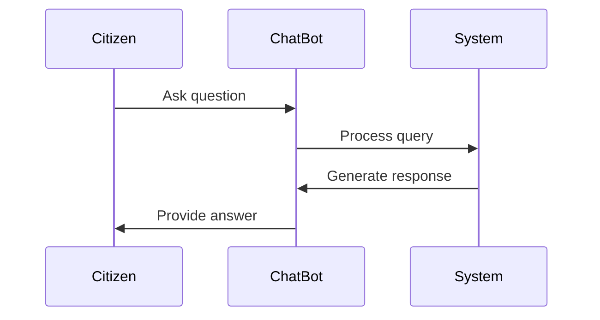
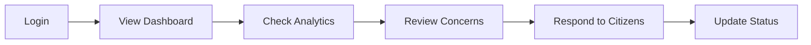
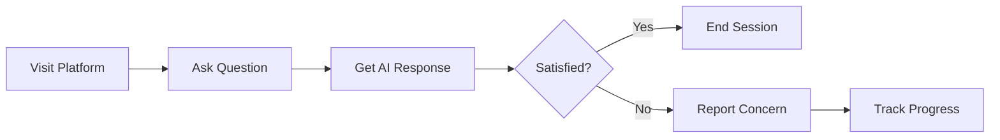

# Quick Start

Get CitizenAI up and running in minutes with this comprehensive quick start guide.

## Before You Begin

Ensure you have completed the [Installation](installation.md) process before proceeding.

## Running CitizenAI

CitizenAI offers two versions to suit different needs:

=== "Demo Version (Recommended for Testing)"
    The demo version runs without AI dependencies and is perfect for testing the interface and basic functionality.
    
    ```bash
    # Navigate to project directory
    cd Citizen-AI
    
    # Run demo version
    python app_demo.py
    ```
    
    !!! success "Demo Features"
        - Full UI experience
        - Mock chat responses
        - Sample analytics data
        - No external API dependencies

=== "Full AI Version"
    The full version includes IBM Watson integration and requires API credentials.
    
    ```bash
    # Run full AI version
    python app.py
    ```
    
    !!! warning "AI Version Requirements"
        Requires IBM Watson API credentials. See [Configuration](configuration.md) for setup details.

## First Access

1. **Start the Application**
   ```bash
   python app_demo.py
   ```

2. **Open Your Browser**
   Navigate to: `http://localhost:5000`

3. **Login**
   Use the default credentials:
   - **Username**: `admin`
   - **Password**: `password`

## Interface Overview

### Main Dashboard

After logging in, you'll see the main dashboard with:

- **📊 Analytics Cards**: Key metrics and statistics
- **📈 Charts**: Interactive visualizations
- **🔄 Real-time Updates**: Live data refresh
- **📱 Responsive Design**: Works on all screen sizes

### Navigation Menu

| Section | Description |
|---------|-------------|
| **Dashboard** | Main analytics and overview |
| **Chat** | AI-powered citizen assistance |
| **Concerns** | Issue reporting and tracking |
| **Services** | Available government services |
| **About** | Platform information |

## Key Features Demo

### 1. AI Chat Assistant



**Try these sample questions:**

- "What services are available for new residents?"
- "How do I report a street light issue?"
- "What are the office hours for city hall?"

### 2. Analytics Dashboard

The dashboard displays:

!!! example "Sample Metrics"
    - **Citizen Interactions**: Daily conversation counts
    - **Sentiment Analysis**: Positive/negative feedback trends
    - **Popular Topics**: Most frequently asked questions
    - **Response Times**: Average AI response performance

### 3. Concern Reporting

Test the concern reporting system:

1. Navigate to **Concerns** section
2. Click **"Report New Concern"**
3. Fill out the form with sample data
4. Submit and track the concern status

## Configuration Basics

### Environment Variables

Create a `.env` file for configuration:

```bash title=".env"
# Basic Configuration
FLASK_ENV=development
FLASK_DEBUG=True
SECRET_KEY=your-secret-key-here

# IBM Watson Configuration (for full AI version)
WATSON_API_KEY=your-watson-api-key
WATSON_URL=your-watson-url
WATSON_VERSION=2021-06-14
```

### Default Settings

```python title="Default Configuration"
# Server Settings
HOST = '127.0.0.1'
PORT = 5000
DEBUG = True

# Session Settings
SESSION_TYPE = 'filesystem'
PERMANENT_SESSION_LIFETIME = 1800  # 30 minutes
```

## Testing the Features

### Chat Functionality

1. **Navigate to Chat**: Click on the "Chat" menu item
2. **Start Conversation**: Type a message in the input field
3. **View Response**: See AI-generated or demo responses
4. **Test Different Queries**: Try various question types

### Analytics Features

1. **View Dashboard**: Check real-time metrics
2. **Interact with Charts**: Hover and click on chart elements
3. **Filter Data**: Use date pickers and filters
4. **Export Data**: Download charts and reports

### Concern Management

1. **Submit Concern**: Use the concern reporting form
2. **Track Status**: Monitor concern progress
3. **View History**: Check past submissions
4. **Receive Updates**: Get notification updates

## Performance Tips

!!! tip "Optimization Recommendations"
    - Use the demo version for development and testing
    - Enable caching for production deployments
    - Monitor memory usage with large datasets
    - Configure proper logging levels

## Common Workflows

### For Government Staff



### For Citizens



## Next Steps

Now that you have CitizenAI running:

1. **Explore Features**: Try all available functionality
2. **Configure Settings**: Set up [Configuration](configuration.md) for your needs
3. **Read User Guide**: Dive deeper into [Features](../user-guide/features.md)
4. **API Integration**: Check out [API Reference](../api/overview.md)

## Getting Help

- **Issues**: Check [Troubleshooting](../support/troubleshooting.md)
- **Questions**: See [FAQ](../support/faq.md)
- **Community**: Join discussions on [GitHub](https://github.com/AkhileshMalthi/Citizen-AI/discussions)

---

!!! success "You're All Set!"
    CitizenAI is now running and ready for use. Explore the platform and see how AI can transform citizen engagement!
