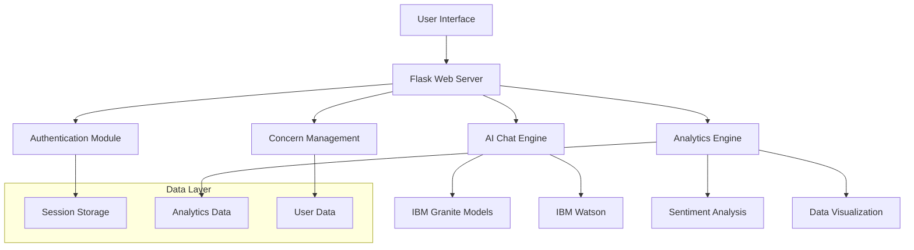

# Welcome to CitizenAI

<div align="center">
  
  
  
  
</div>

## Overview

CitizenAI is an intelligent citizen engagement platform designed to revolutionize how governments interact with the public. Leveraging Flask, IBM Granite models, and IBM Watson, CitizenAI provides real-time, AI-driven responses to citizen inquiries regarding government services, policies, and civic issues.

## ✨ Key Features

!!! tip "Core Capabilities"
    - **💬 AI Chat Assistant** - Real-time conversational AI using IBM Granite models
    - **🧠 Sentiment Analysis** - Automatic feedback classification and trend analysis  
    - **📊 Analytics Dashboard** - Real-time visualizations with interactive charts
    - **⚠️ Concern Reporting** - Issue submission and tracking system
    - **🔐 User Authentication** - Secure session-based authentication
    - **📱 Responsive Design** - Modern UI that works on all devices

## 🚀 Quick Start

Get started with CitizenAI in just a few steps:

```bash
# Clone the repository
git clone https://github.com/AkhileshMalthi/Citizen-AI.git
cd Citizen-AI

# Install dependencies
pip install -r requirements.txt

# Run the demo version
python app_demo.py

# Access at: http://localhost:5000
# Login: admin / password
```

## 🏗️ Architecture



## 🎯 Use Cases

=== "Government Services"
    - Citizen inquiry management
    - Policy information distribution
    - Service request handling
    - Feedback collection and analysis

=== "Public Engagement"
    - Real-time Q&A sessions
    - Community concern tracking
    - Public opinion analysis
    - Automated response systems

=== "Analytics & Insights"
    - Sentiment trend analysis
    - Service usage patterns
    - Citizen satisfaction metrics
    - Performance dashboards

## 🌟 What Makes CitizenAI Special?

!!! success "AI-Powered Intelligence"
    CitizenAI leverages cutting-edge IBM Granite models and Watson AI to provide intelligent, context-aware responses to citizen inquiries.

!!! info "Real-Time Analytics"
    Get instant insights into citizen engagement patterns, sentiment trends, and service performance through interactive dashboards.

!!! note "Easy Integration"
    Built with Flask and modern web technologies, CitizenAI can be easily integrated into existing government systems.

## 📚 Documentation Structure

This documentation is organized into several sections:

- **[Getting Started](getting-started/installation.md)** - Installation, setup, and initial configuration
- **[User Guide](user-guide/features.md)** - Detailed feature documentation and usage guides
- **[API Reference](api/overview.md)** - Complete API documentation for developers
- **[Development](development/contributing.md)** - Contributing guidelines and development setup
- **[Support](support/faq.md)** - FAQ, troubleshooting, and community resources

## 🤝 Contributing

We welcome contributions! Please see our [Contributing Guide](development/contributing.md) for details on how to get involved.

## 📄 License

CitizenAI is released under the [MIT License](https://github.com/AkhileshMalthi/Citizen-AI/blob/main/LICENSE).

---

<div align="center">
  <strong>Ready to get started? Check out our <a href="getting-started/installation/">Installation Guide</a>!</strong>
</div>
