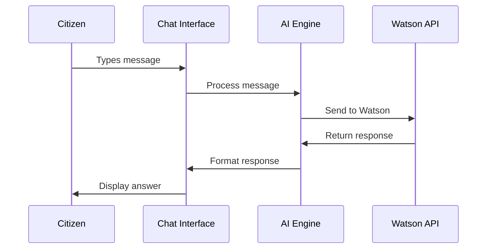
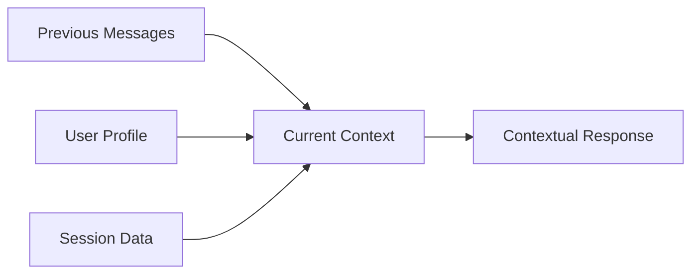
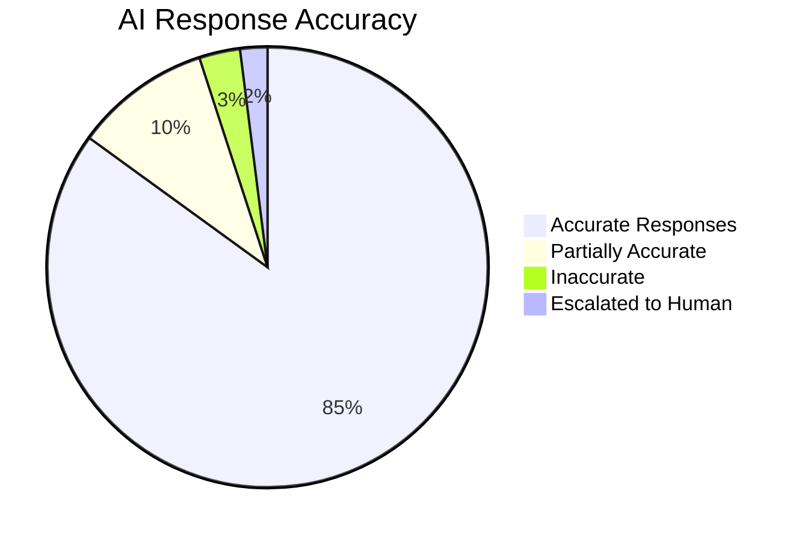

# AI Chat Assistant

The AI Chat Assistant is the core feature of CitizenAI, providing intelligent, real-time responses to citizen inquiries using advanced AI technology.

## Overview

The Chat Assistant leverages IBM Granite models and Watson AI to understand citizen queries and provide accurate, contextual responses about government services, policies, and procedures.

## Key Features

### 🤖 Natural Language Processing

The AI understands queries in natural, everyday language:

=== "Example Queries"
    - "What are your office hours?"
    - "How do I apply for a business license?"
    - "Where can I pay my water bill?"
    - "What's the process for reporting a pothole?"

=== "AI Capabilities"
    - **Intent Recognition**: Identifies what users are trying to accomplish
    - **Entity Extraction**: Pulls out important details from queries
    - **Context Awareness**: Maintains conversation context
    - **Multi-turn Conversations**: Handles follow-up questions

### 💬 Conversation Management



## Using the Chat Assistant

### Starting a Conversation

1. **Navigate to Chat**: Click the "Chat" button in the main navigation
2. **Type Your Question**: Enter your question in the message box
3. **Send**: Press Enter or click the send button
4. **Receive Response**: The AI will provide an immediate response

### Best Practices for Questions

!!! tip "Getting the Best Responses"
    - **Be specific**: "How do I renew my driver's license?" vs "driver's license"
    - **Use natural language**: Write as you would speak to a person
    - **Provide context**: Include relevant details about your situation
    - **Ask follow-ups**: The AI remembers the conversation context

### Example Conversations

#### Service Inquiry

```
👤 User: What services are available for new residents?

🤖 AI: Welcome! New residents can access several services:

• **Voter Registration**: Register to vote at City Hall or online
• **Utility Setup**: Connect water, electric, and waste services
• **Library Card**: Get a free library card with proof of residency
• **Business Licenses**: Information for starting a business
• **Property Records**: Access property tax and assessment information

Would you like specific information about any of these services?

👤 User: Tell me more about voter registration

🤖 AI: Voter registration for new residents:

**Required Documents:**
• Photo ID (driver's license or state ID)
• Proof of residence (utility bill, lease agreement)

**Registration Options:**
• Online: Visit our voter portal
• In-person: City Hall, Room 204
• By mail: Download and mail the form

**Deadlines:**
• Register at least 30 days before any election
• Same-day registration available for some elections

**Office Hours:**
• Monday-Friday: 8:00 AM - 5:00 PM
• Saturday: 9:00 AM - 1:00 PM (election months only)

Need help with anything else?
```

## AI Capabilities

### Sentiment Analysis

The AI automatically analyzes the sentiment of conversations:

- **Positive Sentiment**: 😊 Happy, satisfied interactions
- **Neutral Sentiment**: 😐 Informational, factual exchanges  
- **Negative Sentiment**: 😟 Frustrated, angry, or upset users

```python
# Example sentiment analysis result
{
    "sentiment": "negative",
    "confidence": 0.85,
    "indicators": ["frustrated", "angry", "problem"],
    "suggested_actions": ["escalate_to_human", "priority_response"]
}
```

### Intent Recognition

The system recognizes common intents:

| Intent | Description | Example |
|--------|-------------|---------|
| **Service Request** | User needs a specific service | "I need to pay my water bill" |
| **Information Inquiry** | User seeks information | "What are your hours?" |
| **Complaint** | User has a complaint | "The streetlight is broken" |
| **Emergency** | Urgent situation | "There's a water main break" |

### Context Awareness

The AI maintains conversation context:



## Configuration Options

### Demo vs AI Mode

=== "Demo Mode"
    ```python
    # Uses pre-defined responses
    CHAT_MODE = "demo"
    RESPONSES = {
        "greeting": "Hello! How can I help you today?",
        "hours": "Our office hours are Monday-Friday, 8 AM to 5 PM.",
        "default": "I'd be happy to help you with that!"
    }
    ```

=== "AI Mode"
    ```python
    # Uses IBM Watson AI
    CHAT_MODE = "ai"
    WATSON_CONFIG = {
        "api_key": "your_watson_api_key",
        "url": "your_watson_url",
        "version": "2021-06-14"
    }
    ```

### Customization

```python
# Chat configuration
CHAT_CONFIG = {
    "max_message_length": 500,
    "session_timeout": 1800,  # 30 minutes
    "enable_history": True,
    "enable_sentiment": True,
    "escalation_threshold": 0.7  # Negative sentiment threshold
}
```

## API Integration

### Send Message

```python
import requests

response = requests.post('/api/v1/chat/message', json={
    'message': 'What are your office hours?',
    'session_id': 'user_session_123'
})

# Response
{
    "success": true,
    "data": {
        "response": "Our office hours are Monday through Friday...",
        "confidence": 0.95,
        "intent": "hours_inquiry",
        "sentiment": "neutral"
    }
}
```

### Get Chat History

```python
response = requests.get('/api/v1/chat/history', params={
    'session_id': 'user_session_123',
    'limit': 10
})
```

## Performance Metrics

### Response Time

- **Average Response Time**: < 2 seconds
- **95th Percentile**: < 5 seconds
- **Timeout Threshold**: 30 seconds

### Accuracy Metrics



## Troubleshooting

### Common Issues

#### AI Not Responding

1. **Check Watson Configuration**:
   ```bash
   # Verify Watson credentials
   echo $WATSON_API_KEY
   ```

2. **Test Network Connectivity**:
   ```bash
   curl -I https://api.us-south.assistant.watson.cloud.ibm.com
   ```

3. **Review Application Logs**:
   ```bash
   tail -f logs/citizenai.log
   ```

#### Slow Responses

- **Check Watson API limits**
- **Monitor network latency**
- **Review system resources**

#### Inaccurate Responses

- **Update Watson training data**
- **Refine intent recognition**
- **Add more examples to training set**

### Fallback Options

When AI is unavailable:

1. **Demo Mode**: Switch to pre-defined responses
2. **Human Escalation**: Transfer to human agents
3. **FAQ Lookup**: Search frequently asked questions
4. **Contact Information**: Provide direct contact details

## Advanced Features

### Multi-language Support

```python
# Language detection and response
SUPPORTED_LANGUAGES = ['en', 'es', 'fr']

def detect_language(message):
    # Auto-detect user's language
    return language_detector.detect(message)

def respond_in_language(response, target_language):
    # Translate response if needed
    return translator.translate(response, target_language)
```

### Escalation Rules

```python
ESCALATION_RULES = {
    "negative_sentiment": {"threshold": 0.8, "action": "human_agent"},
    "complex_query": {"confidence": 0.3, "action": "specialist"},
    "emergency": {"keywords": ["emergency", "urgent"], "action": "priority_queue"}
}
```

### Analytics Integration

The chat system automatically tracks:

- **Message volume** per hour/day
- **Response accuracy** ratings
- **User satisfaction** scores
- **Common topics** and trends
- **Escalation rates** by type

## Next Steps

- **[Analytics Dashboard](dashboard.md)** - View chat performance metrics
- **[Concern Reporting](concerns.md)** - Handle complex issues
- **[API Reference](../api/overview.md)** - Integrate chat functionality
