# Concern Reporting

The Concern Reporting system allows citizens to submit issues, track their progress, and receive updates on resolution efforts. This comprehensive issue management system streamlines government response to citizen concerns.

## Overview

CitizenAI's Concern Reporting feature provides a structured way for citizens to:

- **Report Issues**: Submit detailed problem reports
- **Track Progress**: Monitor resolution status in real-time
- **Receive Updates**: Get notifications on concern progress
- **Provide Feedback**: Rate resolution quality

## Types of Concerns

### Category Classification

The system automatically categorizes concerns into predefined types:

=== "Infrastructure"
    - Road repairs and potholes
    - Street lighting issues
    - Traffic signal problems
    - Sidewalk maintenance
    - Bridge and tunnel concerns

=== "Environmental"
    - Waste collection issues
    - Water quality problems
    - Noise complaints
    - Air quality concerns
    - Illegal dumping

=== "Public Safety"
    - Emergency situations
    - Crime reporting
    - Public hazards
    - Security concerns
    - Fire safety issues

=== "Administrative"
    - Service complaints
    - Staff conduct issues
    - Process improvement suggestions
    - Policy questions
    - General feedback

### Priority Levels

```mermaid
graph TD
    A[Concern Submitted] --> B{Assess Priority}
    B -->|Immediate Danger| C[🚨 Emergency]
    B -->|Significant Impact| D[⚠️ High Priority]
    B -->|Moderate Impact| E[📋 Medium Priority]
    B -->|Minor Issue| F[📝 Low Priority]
    
    C --> G[Immediate Response]
    D --> H[24-48 Hour Response]
    E --> I[3-7 Day Response]
    F --> J[1-2 Week Response]
```



## Submitting a Concern

### Step-by-Step Process

1. **Access the Form**
   - Navigate to "Concerns" in the main menu
   - Click "Report New Concern"

2. **Provide Details**
   ```markdown
   Required Information:
   - Concern title (brief description)
   - Detailed description
   - Category selection
   - Location information
   - Contact details (optional for anonymous reports)
   
   Optional Information:
   - Photo attachments
   - Preferred contact method
   - Urgency level
   - Related previous concerns
   ```

3. **Submit and Receive Tracking Number**

### Form Example

```html
<form id="concern-form">
    <div class="form-group">
        <label for="title">Concern Title *</label>
        <input type="text" id="title" required maxlength="100"
               placeholder="Brief description of the issue">
    </div>
    
    <div class="form-group">
        <label for="category">Category *</label>
        <select id="category" required>
            <option value="">Select a category</option>
            <option value="infrastructure">Infrastructure</option>
            <option value="environmental">Environmental</option>
            <option value="safety">Public Safety</option>
            <option value="administrative">Administrative</option>
        </select>
    </div>
    
    <div class="form-group">
        <label for="description">Description *</label>
        <textarea id="description" required rows="5"
                  placeholder="Provide detailed information about the concern"></textarea>
    </div>
    
    <div class="form-group">
        <label for="location">Location</label>
        <input type="text" id="location"
               placeholder="Address or landmark">
    </div>
    
    <div class="form-group">
        <label for="photos">Attach Photos</label>
        <input type="file" id="photos" multiple accept="image/*">
    </div>
</form>
```

## Tracking and Status Updates

### Tracking System

Each concern receives a unique tracking number:

```python
# Tracking number format: TRK-YYYY-NNNN
tracking_number = "TRK-2025-0001"

concern_status = {
    "id": "concern_12345",
    "tracking_number": "TRK-2025-0001",
    "title": "Broken street light on Main Street",
    "status": "in_progress",
    "priority": "medium",
    "submitted": "2025-01-01T10:00:00Z",
    "last_updated": "2025-01-02T14:30:00Z",
    "estimated_resolution": "2025-01-05T17:00:00Z"
}
```

### Status Workflow


### Status Descriptions

| Status | Description | Typical Duration |
|--------|-------------|------------------|
| **Submitted** | Concern received and logged | Immediate |
| **Under Review** | Initial assessment in progress | 1-2 business days |
| **Assigned** | Assigned to appropriate department | 1 business day |
| **In Progress** | Active work on resolution | Varies by complexity |
| **Escalated** | Requires higher-level attention | Additional 2-5 days |
| **Resolved** | Solution implemented | N/A |
| **Closed** | Concern fully addressed | N/A |
| **Rejected** | Not a valid concern or outside scope | 1-2 business days |

## Management Dashboard

### For Government Staff

Administrative interface for managing concerns:

#### Queue Management


#### Workload Distribution

```python
# Department workload tracking
workload_stats = {
    "public_works": {
        "assigned": 45,
        "in_progress": 23,
        "avg_resolution_days": 5.2
    },
    "environmental": {
        "assigned": 12,
        "in_progress": 8,
        "avg_resolution_days": 3.1
    },
    "administration": {
        "assigned": 28,
        "in_progress": 15,
        "avg_resolution_days": 7.8
    }
}
```

### Performance Metrics

Track concern management effectiveness:

=== "Resolution Metrics"
    - Average resolution time by category
    - Resolution rate percentage
    - Escalation frequency
    - Citizen satisfaction scores

=== "Volume Metrics"
    - Daily/weekly concern volume
    - Peak submission times
    - Seasonal patterns
    - Geographic distribution

=== "Quality Metrics"
    - First-contact resolution rate
    - Reopened concern percentage
    - Staff productivity measures
    - Process efficiency scores

## Notification System

### Automated Updates

Citizens receive notifications via their preferred method:

```python
notification_preferences = {
    "email": "user@example.com",
    "sms": "+1234567890",
    "in_app": True,
    "frequency": "major_updates"  # or "all_updates"
}

# Notification triggers
NOTIFICATION_EVENTS = [
    "concern_received",
    "status_changed", 
    "assigned_to_department",
    "resolution_update",
    "concern_resolved",
    "concern_closed"
]
```

### Communication Templates

```html
<!-- Email template for status update -->
<div class="concern-update">
    <h2>Concern Update: {{tracking_number}}</h2>
    <p><strong>Status:</strong> {{new_status}}</p>
    <p><strong>Update:</strong> {{update_message}}</p>
    <p><strong>Estimated Resolution:</strong> {{estimated_date}}</p>
    <a href="{{tracking_url}}">View Full Details</a>
</div>
```

## Integration Features

### Chat Integration

Seamless connection with the AI chat system:

```python
# Escalate chat to concern
def escalate_to_concern(chat_session):
    concern_data = {
        "title": extract_issue_summary(chat_session),
        "description": format_chat_transcript(chat_session),
        "category": classify_concern(chat_session),
        "priority": assess_urgency(chat_session),
        "source": "chat_escalation"
    }
    return create_concern(concern_data)
```

### Analytics Integration

Concern data feeds into analytics dashboard:

- **Trend analysis** of concern types
- **Geographic hotspots** identification
- **Department performance** metrics
- **Citizen satisfaction** tracking

### External System Integration

```python
# Integration with existing city systems
EXTERNAL_INTEGRATIONS = {
    "work_order_system": {
        "endpoint": "https://city.gov/api/work-orders",
        "auth": "api_key",
        "sync_frequency": "real_time"
    },
    "gis_mapping": {
        "endpoint": "https://city.gov/api/gis",
        "features": ["location_validation", "asset_lookup"]
    },
    "citizen_portal": {
        "endpoint": "https://city.gov/portal/api",
        "features": ["user_lookup", "notification_delivery"]
    }
}
```

## API Reference

### Submit Concern

```http
POST /api/v1/concerns
Content-Type: application/json

{
    "title": "Broken street light",
    "description": "Street light at intersection of Main and Oak is not working",
    "category": "infrastructure",
    "location": "Main St & Oak Ave",
    "priority": "medium",
    "contact": {
        "email": "citizen@example.com",
        "phone": "555-0123"
    },
    "anonymous": false
}
```

**Response:**
```json
{
    "success": true,
    "data": {
        "concern_id": "concern_12345",
        "tracking_number": "TRK-2025-0001",
        "status": "submitted",
        "estimated_resolution": "2025-01-05T17:00:00Z"
    }
}
```

### Track Concern

```http
GET /api/v1/concerns/{tracking_number}
```

**Response:**
```json
{
    "success": true,
    "data": {
        "tracking_number": "TRK-2025-0001",
        "title": "Broken street light",
        "status": "in_progress",
        "priority": "medium",
        "submitted": "2025-01-01T10:00:00Z",
        "last_updated": "2025-01-02T14:30:00Z",
        "updates": [
            {
                "timestamp": "2025-01-01T10:00:00Z",
                "status": "submitted",
                "message": "Concern received and logged"
            },
            {
                "timestamp": "2025-01-01T15:30:00Z",
                "status": "assigned",
                "message": "Assigned to Public Works Department"
            }
        ]
    }
}
```

### Update Concern (Admin)

```http
PUT /api/v1/concerns/{concern_id}
Authorization: Bearer admin_token

{
    "status": "in_progress",
    "message": "Work crew dispatched to location",
    "estimated_resolution": "2025-01-04T17:00:00Z"
}
```

## Mobile Support

### Responsive Design

The concern reporting system is fully responsive:

- **Mobile-first design** for easy smartphone use
- **Touch-optimized interface** for tablets
- **GPS integration** for automatic location detection
- **Camera integration** for photo attachments

### Progressive Web App

```javascript
// Service worker for offline functionality
self.addEventListener('fetch', event => {
    if (event.request.url.includes('/concerns/submit')) {
        event.respondWith(
            fetch(event.request).catch(() => {
                // Store for later submission when online
                return storeForLaterSubmission(event.request);
            })
        );
    }
});
```

## Best Practices

### For Citizens

!!! tip "Effective Concern Reporting"
    - **Be specific**: Include exact locations and clear descriptions
    - **Provide context**: Explain when the issue was first noticed
    - **Include photos**: Visual evidence helps with assessment
    - **Use appropriate urgency**: Reserve high priority for genuine emergencies
    - **Follow up**: Check tracking status periodically

### For Government Staff

!!! info "Efficient Concern Management"
    - **Acknowledge quickly**: Confirm receipt within 24 hours
    - **Communicate regularly**: Provide status updates every few days
    - **Be transparent**: Explain delays or complications
    - **Close the loop**: Confirm resolution with the reporter
    - **Learn from patterns**: Use data to prevent recurring issues

## Privacy and Security

### Data Protection

- **Personal information**: Stored securely and encrypted
- **Anonymous reporting**: Option to submit without personal details
- **Data retention**: Concerns archived after resolution
- **Access controls**: Role-based access to concern details

### Security Measures

```python
# Security configuration
SECURITY_CONFIG = {
    "file_upload": {
        "max_size": "10MB",
        "allowed_types": [".jpg", ".png", ".pdf"],
        "virus_scanning": True
    },
    "data_encryption": {
        "personal_info": "AES-256",
        "file_storage": "encrypted_at_rest"
    },
    "access_logging": {
        "enabled": True,
        "retention": "7_years"
    }
}
```

## Troubleshooting

### Common Issues

#### Form Submission Failures

1. **Check required fields**: Ensure all mandatory fields are completed
2. **File size limits**: Verify photos are under 10MB each
3. **Network connectivity**: Confirm internet connection is stable
4. **Browser compatibility**: Use supported browsers (Chrome 90+, Firefox 88+)

#### Tracking Number Not Working

1. **Verify format**: Ensure tracking number follows TRK-YYYY-NNNN format
2. **Check spelling**: Confirm all characters are entered correctly
3. **Wait for processing**: New concerns may take a few minutes to appear

#### Status Not Updating

1. **Refresh page**: Browser cache may show outdated information
2. **Check notification settings**: Ensure updates are enabled
3. **Contact support**: If status seems stuck for extended period

## Next Steps

- **[Analytics Dashboard](dashboard.md)** - Monitor concern trends and resolution metrics
- **[AI Chat Assistant](chat.md)** - Learn how chat escalates to concerns  
- **[API Reference](../api/overview.md)** - Integrate concern management into external systems
