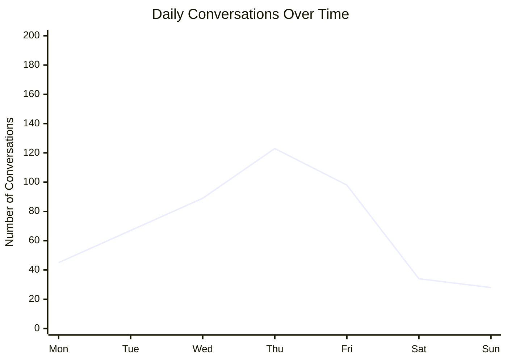
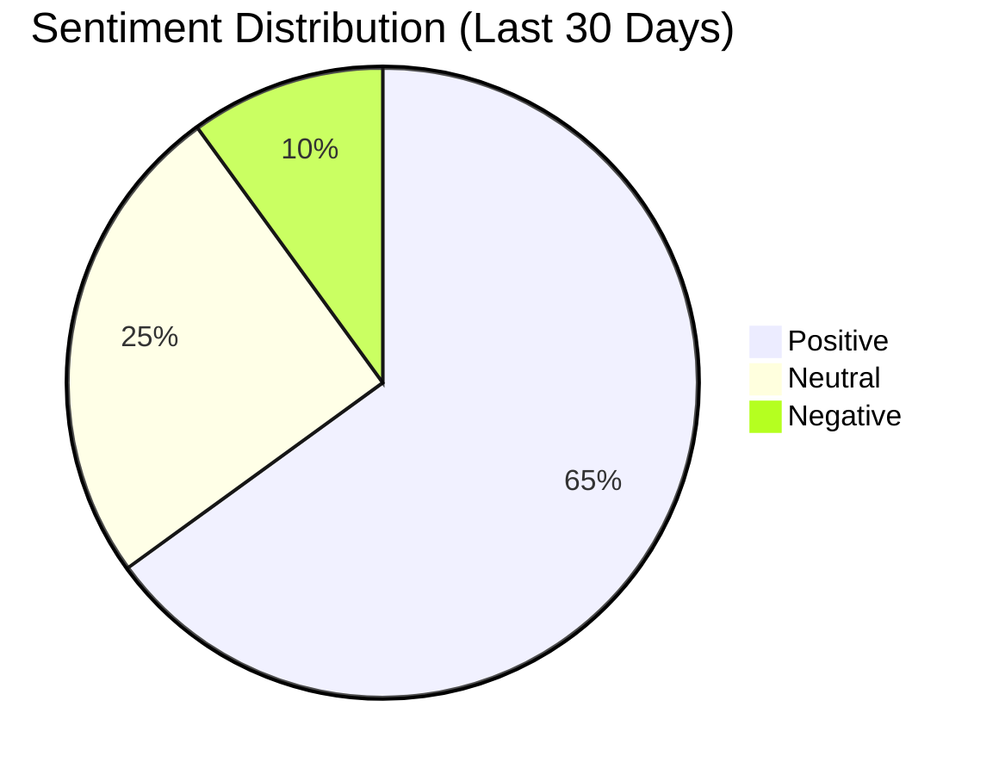
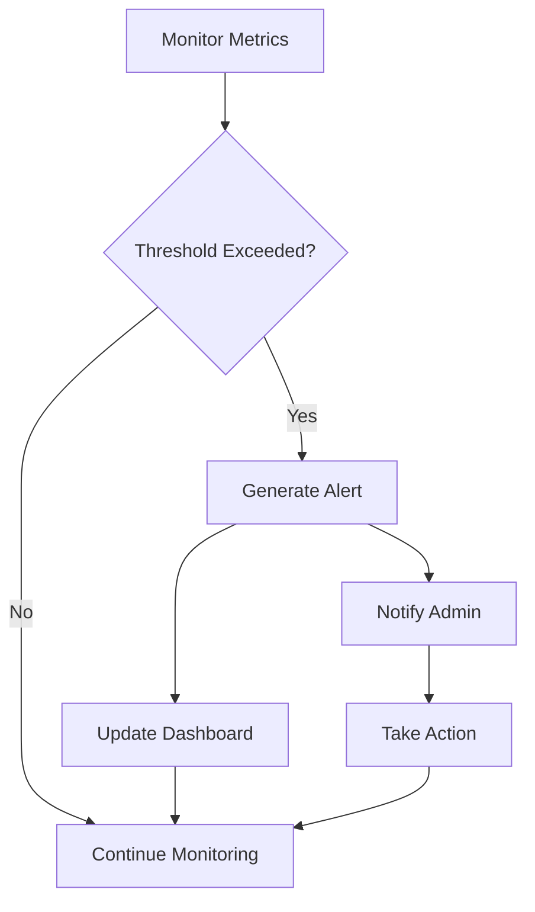
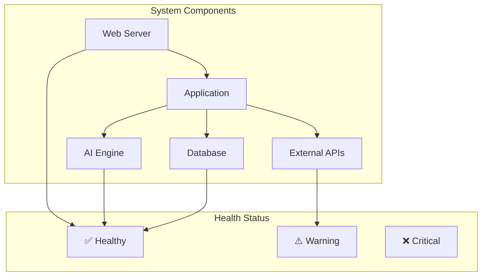
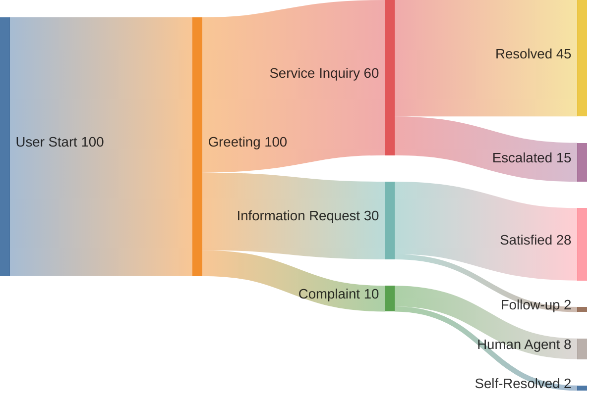
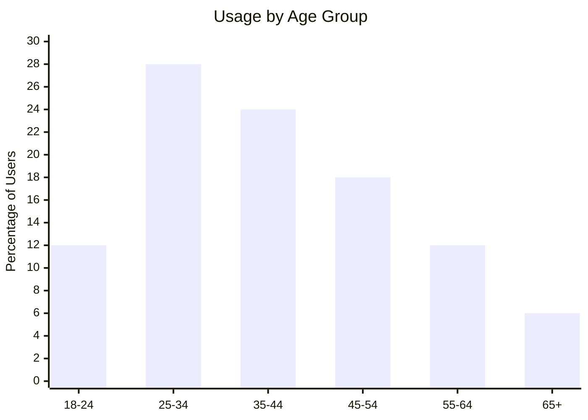

# Analytics Dashboard

The Analytics Dashboard provides comprehensive insights into citizen engagement patterns, system performance, and service effectiveness through interactive visualizations and real-time metrics.

## Dashboard Overview

The main dashboard displays key metrics and trends in an intuitive, easy-to-understand format designed for government staff and administrators.

### Key Metrics Cards

The dashboard features four primary metric cards:

=== "Conversations"
    - **Total Conversations**: Daily, weekly, and monthly conversation counts
    - **Active Sessions**: Currently active chat sessions
    - **Average Duration**: Mean conversation length
    - **Completion Rate**: Percentage of resolved conversations

=== "Sentiment Analysis"
    - **Positive Feedback**: Percentage of positive interactions
    - **Negative Feedback**: Issues requiring attention
    - **Neutral Interactions**: Informational exchanges
    - **Trend Analysis**: Sentiment changes over time

=== "Concern Reports"
    - **New Concerns**: Recently submitted issues
    - **Resolved Issues**: Completed concern resolutions
    - **Average Resolution Time**: Time to resolve concerns
    - **Priority Distribution**: Breakdown by urgency level

=== "System Performance"
    - **Response Time**: AI response speed metrics
    - **Uptime**: System availability percentage
    - **Error Rate**: Failed request percentage
    - **API Usage**: External service utilization

## Interactive Charts

### Conversation Trends



The conversation trends chart shows:

- **Peak Hours**: Identify busiest times of day
- **Weekly Patterns**: Understand usage by day of week
- **Seasonal Trends**: Long-term usage patterns
- **Special Events**: Impact of holidays and events

### Sentiment Distribution



### Top Topics

Interactive word cloud showing most discussed topics:

- **Services**: Most requested government services
- **Policies**: Frequently asked about policies
- **Issues**: Common problems and concerns
- **Locations**: Geographic distribution of inquiries

## Real-time Monitoring

### Live Updates

The dashboard updates in real-time, showing:

!!! info "Real-time Features"
    - **Live conversation counter**
    - **Instant sentiment updates**
    - **Real-time concern submissions**
    - **System health monitoring**

### Alert System



Automated alerts for:

- **High negative sentiment** (>20% in 1 hour)
- **System response time** (>5 seconds average)
- **Error rate spike** (>5% in 10 minutes)
- **Unusual traffic patterns**

## Data Filtering and Export

### Filter Options

Users can filter data by:

=== "Time Ranges"
    - Last 24 hours
    - Last 7 days
    - Last 30 days
    - Custom date range
    - Year-to-date

=== "Categories"
    - Conversation topics
    - Sentiment types
    - Concern categories
    - User types
    - Geographic regions

=== "Metrics"
    - Response times
    - Resolution rates
    - Satisfaction scores
    - Usage patterns

### Export Capabilities

```python
# Export data in multiple formats
EXPORT_FORMATS = {
    "csv": "Comma-separated values",
    "json": "JSON data format",
    "pdf": "PDF report",
    "excel": "Excel spreadsheet"
}

# Example export API call
GET /api/v1/analytics/export?format=csv&date_range=30d&metrics=conversations,sentiment
```

## Performance Analytics

### Response Time Analysis

Track AI and system performance:

| Metric | Target | Current | Status |
|--------|--------|---------|--------|
| **AI Response Time** | <2s | 1.4s | ✅ Good |
| **Page Load Time** | <3s | 2.1s | ✅ Good |
| **API Response** | <1s | 0.8s | ✅ Good |
| **Database Query** | <500ms | 320ms | ✅ Good |

### System Health Dashboard



## User Engagement Analytics

### Conversation Flow Analysis

Track how users navigate through conversations:



### User Satisfaction Metrics

- **Resolution Rate**: 87% of conversations marked as resolved
- **User Ratings**: Average 4.2/5 stars
- **Return Users**: 34% of users return within 30 days
- **Escalation Rate**: 8% of conversations escalated to human agents

## Geographic Analytics

### Usage by Location

Interactive map showing conversation density:

- **Heat map** of conversation volume
- **Regional breakdown** of common topics
- **Service area coverage** analysis
- **Response time by location**

### Demographic Insights



## Administrative Features

### User Management Analytics

Track administrative activities:

- **Admin login frequency**
- **Feature usage by role**
- **Configuration changes**
- **System modifications**

### Audit Trails

Complete audit logging:

```json
{
    "timestamp": "2025-01-01T10:30:00Z",
    "user": "admin_user",
    "action": "export_data",
    "resource": "analytics_dashboard",
    "details": {
        "format": "csv",
        "date_range": "30d",
        "metrics": ["conversations", "sentiment"]
    }
}
```

## Custom Reports

### Report Builder

Create custom reports with:

- **Drag-and-drop interface**
- **Multiple chart types**
- **Custom date ranges**
- **Automated scheduling**

### Scheduled Reports

```python
# Example scheduled report configuration
SCHEDULED_REPORTS = {
    "daily_summary": {
        "frequency": "daily",
        "time": "09:00",
        "recipients": ["admin@city.gov"],
        "format": "pdf"
    },
    "weekly_trends": {
        "frequency": "weekly",
        "day": "monday",
        "time": "08:00",
        "metrics": ["conversations", "sentiment", "concerns"]
    }
}
```

## API Integration

### Analytics API Endpoints

```python
# Get dashboard data
GET /api/v1/analytics/dashboard
{
    "date_range": "7d",
    "metrics": ["conversations", "sentiment", "performance"]
}

# Get detailed metrics
GET /api/v1/analytics/metrics
{
    "metric": "conversations",
    "granularity": "hourly",
    "start_date": "2025-01-01",
    "end_date": "2025-01-07"
}

# Export data
GET /api/v1/analytics/export
{
    "format": "csv",
    "date_range": "30d",
    "include": ["conversations", "sentiment", "topics"]
}
```

### Custom Dashboards

Build custom dashboards using the API:

```javascript
// Fetch dashboard data
const response = await fetch('/api/v1/analytics/dashboard', {
    method: 'GET',
    headers: {
        'Authorization': 'Bearer ' + apiKey
    }
});

const data = await response.json();

// Update custom dashboard components
updateConversationChart(data.conversations);
updateSentimentPie(data.sentiment);
updateMetricsCards(data.metrics);
```

## Performance Optimization

### Caching Strategy

- **Real-time data**: No caching
- **Hourly aggregates**: 5-minute cache
- **Daily summaries**: 1-hour cache
- **Historical data**: 24-hour cache

### Data Retention

```python
DATA_RETENTION = {
    "raw_conversations": "90 days",
    "hourly_aggregates": "1 year",
    "daily_summaries": "5 years",
    "monthly_reports": "10 years"
}
```

## Troubleshooting

### Common Issues

#### Dashboard Not Loading

1. **Check browser compatibility**:
   - Chrome 90+, Firefox 88+, Safari 14+
   - JavaScript enabled
   - Cookies enabled

2. **Clear browser cache**:
   ```bash
   # Hard refresh
   Ctrl+F5 (Windows) or Cmd+Shift+R (macOS)
   ```

3. **Check network connectivity**:
   ```bash
   # Test API endpoints
   curl http://localhost:5000/api/v1/analytics/dashboard
   ```

#### Charts Not Displaying

1. **Verify data availability**:
   ```python
   # Check if analytics data exists
   from src.analytics import get_dashboard_data
   data = get_dashboard_data(date_range='7d')
   print(f"Data points: {len(data)}")
   ```

2. **Check JavaScript console** for errors

3. **Verify Plotly.js library** is loaded

#### Slow Performance

- **Reduce date range** for large datasets
- **Enable data aggregation** for historical views
- **Use pagination** for detailed reports
- **Optimize database queries**

## Security and Privacy

### Data Protection

!!! security "Privacy Measures"
    - **Data anonymization**: Personal information removed from analytics
    - **Aggregated reporting**: Individual conversations not exposed
    - **Access controls**: Role-based dashboard access
    - **Audit logging**: All data access tracked

### Compliance

- **GDPR compliance**: Right to be forgotten implemented
- **Data retention policies**: Automatic data purging
- **Privacy by design**: Analytics built with privacy in mind

## Next Steps

- **[Concern Reporting](concerns.md)** - Track and manage citizen issues
- **[API Reference](../api/overview.md)** - Integrate analytics into your systems
- **[Chat Assistant](chat.md)** - Understand conversation data sources
