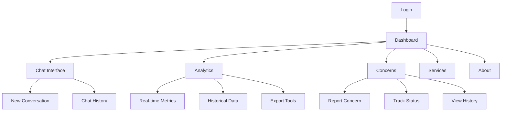
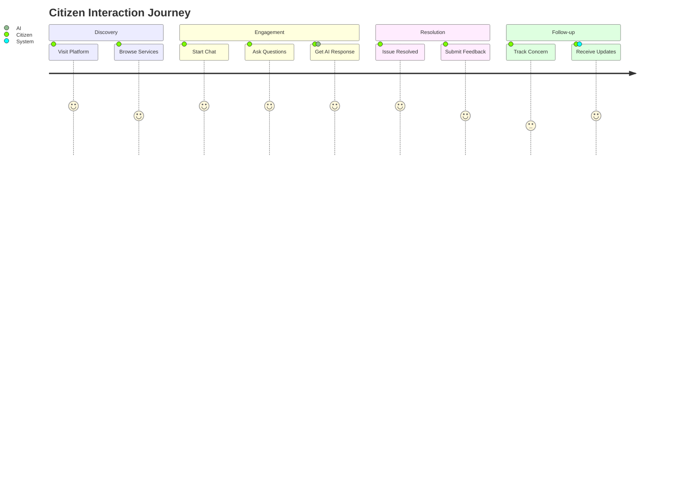
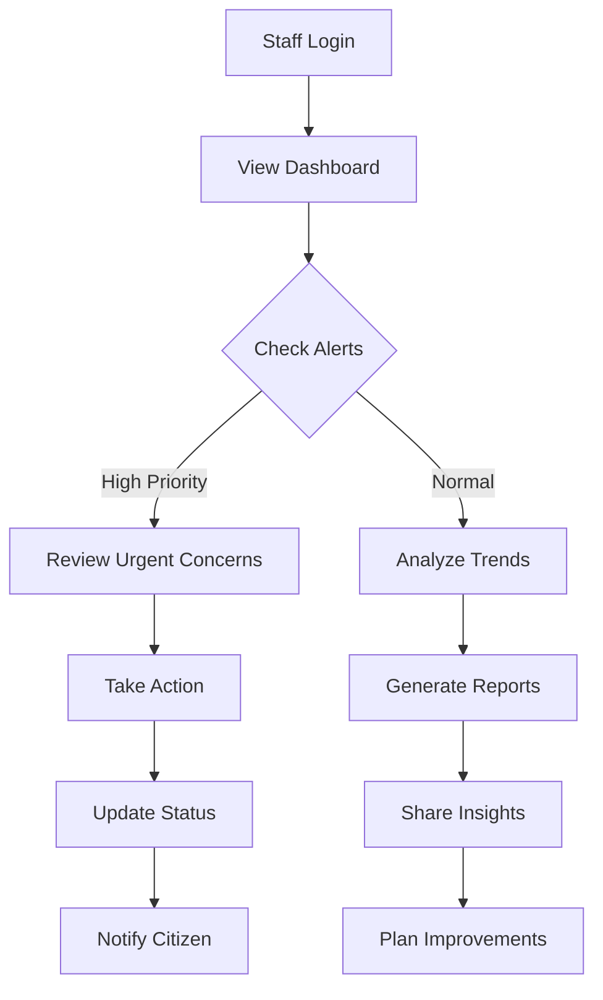

# Features Overview

CitizenAI provides a comprehensive suite of features designed to enhance citizen engagement and streamline government services. This page provides an overview of all major features and capabilities.

## Core Features

### 🤖 AI-Powered Chat Assistant

The heart of CitizenAI is its intelligent chat assistant that provides instant, accurate responses to citizen inquiries.

!!! info "Chat Assistant Capabilities"
    - **Natural Language Processing**: Understands complex queries in everyday language
    - **Context Awareness**: Maintains conversation context for better responses
    - **Multi-topic Support**: Handles various government services and policy questions
    - **Real-time Responses**: Instant AI-generated answers
    - **Escalation Support**: Seamlessly transfers complex issues to human agents

**Key Technologies:**
- IBM Granite Language Models
- IBM Watson Assistant
- Advanced sentiment analysis
- Context-aware conversation management

### 📊 Real-time Analytics Dashboard

Comprehensive analytics provide insights into citizen engagement patterns and service performance.

=== "Engagement Metrics"
    - Total conversations per day/week/month
    - Average session duration
    - User return rate
    - Peak usage hours
    - Geographic distribution

=== "Sentiment Analysis"
    - Positive/negative feedback trends
    - Satisfaction scores
    - Issue category sentiment
    - Trend analysis over time
    - Alert system for negative patterns

=== "Performance Metrics"
    - Response time analytics
    - Resolution rate tracking
    - AI accuracy measurements
    - System uptime monitoring
    - Error rate analysis

### ⚠️ Intelligent Concern Management

Streamlined system for citizens to report issues and track their resolution.

**Concern Categories:**
- Infrastructure issues
- Service complaints
- Policy inquiries
- Emergency reports
- General feedback

**Management Features:**
- Automated categorization
- Priority assignment
- Status tracking
- Escalation workflows
- Resolution metrics

### 🔐 Secure Authentication System

Enterprise-grade security ensures data protection and user privacy.

!!! security "Security Features"
    - Session-based authentication
    - Role-based access control
    - Secure session management
    - Data encryption
    - Audit logging

## Feature Matrix

| Feature | Demo Version | Full AI Version | Description |
|---------|--------------|-----------------|-------------|
| **Basic Chat** | ✅ | ✅ | Simple Q&A interface |
| **AI Responses** | ❌ | ✅ | IBM Watson-powered answers |
| **Analytics Dashboard** | ✅ (Mock Data) | ✅ | Real-time metrics and charts |
| **Sentiment Analysis** | ❌ | ✅ | Emotion detection in conversations |
| **Concern Reporting** | ✅ | ✅ | Issue submission and tracking |
| **User Authentication** | ✅ | ✅ | Secure login system |
| **Data Export** | ✅ | ✅ | Download reports and analytics |
| **Multi-language** | ❌ | ✅ | Support for multiple languages |

## User Interfaces

### Responsive Design

CitizenAI features a modern, responsive design that works seamlessly across devices:

- **Desktop**: Full-featured dashboard experience
- **Tablet**: Optimized layout for touch interfaces
- **Mobile**: Streamlined mobile-first design
- **Accessibility**: WCAG 2.1 AA compliant

### Navigation Structure

## Integration Capabilities

### API Integration

CitizenAI provides RESTful APIs for integration with existing systems:

- **Authentication API**: User management and authentication
- **Chat API**: Programmatic chat interactions
- **Analytics API**: Data export and reporting
- **Concern API**: Issue management and tracking

### Third-party Integrations

!!! tip "Available Integrations"
    - **CRM Systems**: Salesforce, HubSpot integration
    - **Ticketing Systems**: Jira, ServiceNow compatibility
    - **Analytics Tools**: Google Analytics, Tableau connectors
    - **Communication**: Slack, Microsoft Teams notifications
    - **Database Systems**: PostgreSQL, MySQL support

## Workflow Examples

### Citizen Journey

### Government Staff Workflow

## Customization Options

### Theme Configuration

- **Color Schemes**: Government branding support
- **Logo Integration**: Custom organizational logos
- **Layout Options**: Flexible dashboard arrangements
- **Font Customization**: Accessibility-focused typography

### Content Management

- **FAQ Management**: Editable frequently asked questions
- **Service Information**: Customizable service descriptions
- **Policy Updates**: Dynamic policy information updates
- **Notification Templates**: Configurable message templates

### Analytics Customization

- **Custom Metrics**: Define organization-specific KPIs
- **Report Templates**: Branded report generation
- **Dashboard Widgets**: Configurable dashboard components
- **Alert Configuration**: Custom threshold settings

## Accessibility Features

CitizenAI is designed with accessibility in mind:

!!! accessibility "Accessibility Compliance"
    - **WCAG 2.1 AA**: Full compliance with accessibility standards
    - **Screen Reader**: Compatible with popular screen readers
    - **Keyboard Navigation**: Full keyboard accessibility
    - **High Contrast**: Support for high contrast displays
    - **Font Scaling**: Responsive to user font size preferences

### Inclusive Design Elements

- Clear, simple language in all interfaces
- Consistent navigation patterns
- Alternative text for all images
- Semantic HTML structure
- Focus indicators for interactive elements

## Performance Characteristics

### Scalability

- **Concurrent Users**: Supports 1000+ simultaneous users
- **Response Time**: Sub-second AI response times
- **Data Processing**: Real-time analytics processing
- **Storage**: Efficient data storage and retrieval

### Reliability

- **Uptime**: 99.9% availability target
- **Error Handling**: Graceful degradation on failures
- **Backup Systems**: Automated data backup and recovery
- **Monitoring**: Real-time system health monitoring

## Security and Privacy

### Data Protection

!!! shield "Privacy Measures"
    - **Data Encryption**: End-to-end encryption for sensitive data
    - **Privacy Controls**: User data privacy management
    - **Audit Logging**: Comprehensive activity logging
    - **Compliance**: GDPR and other privacy regulation compliance
    - **Anonymization**: Automatic PII anonymization options

### Security Measures

- Regular security assessments
- Penetration testing
- Vulnerability scanning
- Security incident response procedures
- Regular security updates and patches

## Next Steps

Now that you understand CitizenAI's features, explore specific functionality:

- **[AI Chat Assistant](chat.md)** - Detailed chat functionality guide
- **[Analytics Dashboard](dashboard.md)** - Complete analytics documentation
- **[Concern Reporting](concerns.md)** - Issue management system guide

For technical implementation details, see the [API Reference](../api/overview.md) section.
